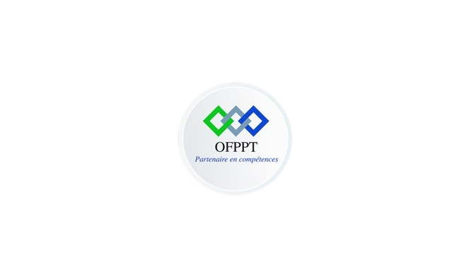

## Présentation de consultation

**Réaliser par :** Boukhar Soufiane

**Encadré parr :** Essaraj Fouad

<!-- new slide -->

#### Branche fonctionnelle

<!-- new slide -->

### Carte d'empathie

<!-- new slide -->

## Empathie : Infirmière de médecine général

<!-- new slide -->

## Empathie : Assistant dentaire

<!-- new slide -->

## Empathie : Orthoptiste

<!-- new slide -->

## Empathie : Psychomotrice

<!-- new slide -->

## Empathie : Orthophoniste

<!-- new slide -->

## Schemas de navigation de médecine général

<!-- new slide -->

## Diagramme de cas d'utilisation

<!-- new slide -->

#### Conception

<!-- new slide -->

## Diagramme de class

